  

### 👋 Hey, I'm Pranesh

A full-stack + ML student at **IIT Bombay** who likes building things *end-to-end* — not stopping at a notebook or a localhost demo, but shipping something real people can open on their phone.

Most of what I make sits where **clean product** meets **hard backend**: async pipelines, vector search, and interfaces that feel effortless on top of them.

### 🔭 What I'm building right now

<table>
  <tr>
    <td width="90" align="center" valign="top"><h2>🚀</h2></td>
    <td valign="top">
      <b><a href="https://github.com/CodeAcc2007-dev/KRNLv3">KRNL</a></b> — a live campus email &amp; deadline intelligence PWA for IIT Bombay students. 
      It sorts your inbox, extracts deadlines automatically, and lets you ask your mail questions in plain English. 
       
      <code>FastAPI</code> &nbsp;<code>React</code>&nbsp; <code>Qdrant</code> &nbsp;<code>Celery</code>&nbsp; <code>Supabase</code>
      &nbsp;&nbsp;•&nbsp;&nbsp; <a href="https://krnlv3.vercel.app"><b>Live&nbsp;app&nbsp;→</b></a>
    </td>
  </tr>
</table>

### 🧰 My toolbox

  
   
  
   
  

### 📊 By the numbers

  
  

<!-- Contribution snake — renders after you add the snake workflow (see setup). -->

  

### 🌱 Also into

- **Deep learning** — a CNN traffic-sign classifier for autonomous-vehicle perception ([WiDS 5.0](https://github.com/CodeAcc2007-dev/WiDS-Traffic-Sign-Classifier))
- **Reinforcement learning** — [RL-Arena](https://github.com/CodeAcc2007-dev/RL-Arena-SoC) (Season of Code)

### 🤝 Let's connect

